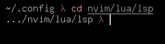

# gnsprompt

A simple zsh prompt made for personal use, but can be useful to someone.


> Prompt screenshot.

## Install

### zinit

Add the line:

``` zsh
zinit light "gnsfujiwara/gnsprompt"
```

### zplug

Add the line:

``` zsh
zplug "gnsfujiwara/gnsprompt"
```

### Manually

Clone the repo in someplace:

``` sh
mkdir "$HOME/.zsh" \
git clone https://github.com/gnsfujiwara/gnsprompt.git "$HOME/.zsh"
```

Add the path of the cloned repo on your `$fpath`

``` zsh
# .zshrc
fpath+=($HOME/.zsh/pure)
```

## Usage

Put the following code on your .zshrc

``` zsh
autoload -Uz promptinit; promptinit
prompt gnsprompt
```

## License

[The Unlicense](./UNLICENSE)
